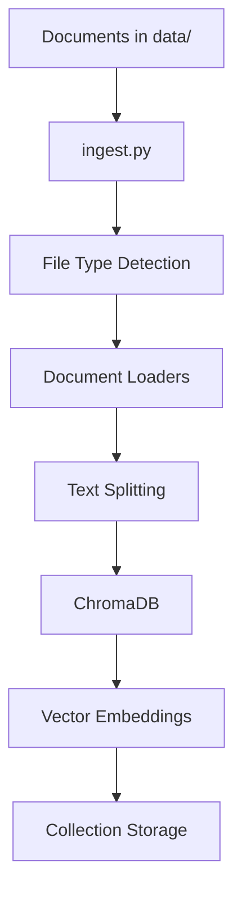

# Data Ingestor 🗂️

A lightweight, multi-format document ingestion service for the MediBot project that processes various document types and stores them in ChromaDB for vector-based semantic search.

## 🚀 Features

- **Multi-Format Support**: Handles TXT, DOCX, DOC, PDF, XLSX, XLS, PPTX, PPT files
- **Smart Chunking**: File-type-specific text splitting for optimal retrieval
- **Lightweight**: Minimal dependencies to reduce Docker image size
- **Robust Error Handling**: Comprehensive logging and graceful error recovery
- **Docker Ready**: Containerized for easy deployment
- **ChromaDB Integration**: Direct integration with vector database

## 📁 Project Structure

```
Data-ingestor/
├── data/                    # Input documents directory
│   ├── *.docx              # Word documents
│   ├── *.pdf               # PDF files
│   ├── *.txt               # Text files
│   └── ...                 # Other supported formats
├── ingest.py               # Main ingestion script
├── requirements.txt        # Python dependencies
├── Dockerfile             # Container configuration
├── entrypoint.sh          # Container startup script
└── readme.md              # This file
```

## 🛠️ Supported File Formats

| Format | Extension | Loader Used | Status |
|--------|-----------|-------------|---------|
| Text | `.txt` | TextLoader | ✅ |
| Word | `.docx` | Docx2txtLoader | ✅ |
| Word Legacy | `.doc` | Docx2txtLoader | ✅ |
| PDF | `.pdf` | PyPDFLoader | ✅ |

## 📋 Prerequisites

- Python 3.10+
- Docker (optional, for containerized deployment)
- ChromaDB server running

## 🔧 Installation

### Local Development

1. **Clone the repository**
   ```bash
   git clone <repository-url>
   cd MediBot/Data-ingestor
   ```

2. **Install dependencies**
   ```bash
   pip install -r requirements.txt
   ```

3. **Set up environment variables** (optional)
   ```bash
   export CHROMADB_HOST=localhost
   export CHROMADB_PORT=5000
   export CHROMADB_COLLECTION=medical_docs
   ```

4. **Place your documents**
   ```bash
   # Copy your documents to the data/ directory
   cp /path/to/your/documents/* data/
   ```

5. **Run the ingestion script**
   ```bash
   python ingest.py
   ```

### Docker Deployment

1. **Build the Docker image**
   ```bash
   docker build -t medibot-data-ingestor .
   ```

2. **Run the container**
   ```bash
   docker run -p 5000:5000 -v /path/to/your/data:/app/data medibot-data-ingestor
   ```

## 🔧 Configuration

### Environment Variables

| Variable | Default | Description |
|----------|---------|-------------|
| `CHROMADB_HOST` | `localhost` | ChromaDB server host |
| `CHROMADB_PORT` | `5000` | ChromaDB server port |
| `CHROMADB_COLLECTION` | `medical_docs` | Collection name in ChromaDB |

### Chunking Configuration

The script uses file-type-specific chunking strategies:

```python
# Text files
chunk_size=1000, chunk_overlap=200

# PDF files  
chunk_size=1000, chunk_overlap=200

# Word documents
chunk_size=1000, chunk_overlap=200
```

## 📊 Usage

### Basic Usage

```bash
# Run with default settings
python ingest.py
```

### Docker Usage

```bash
# Run with custom data directory
docker run -p 5000:5000 \
  -v /path/to/your/data:/app/data \
  -e CHROMADB_COLLECTION=my_collection \
  medibot-data-ingestor
```

### Programmatic Usage

```python
from ingest import ingest_documents

# Ingest documents from a specific directory
result = ingest_documents(
    data_dir="/path/to/documents",
    collection_name="my_collection"
)
```

## 📈 Output

The script provides detailed logging of the ingestion process:

```
✅ Connected to ChromaDB
📁 Found 5 supported files
📄 Loaded 5 documents from all supported file types
✂️ Split into 25 chunks with file-type-specific configurations
✅ Ingested 25 chunks into ChromaDB collection 'medical_docs'
```

## 🔍 Troubleshooting

### Common Issues

1. **"0 supported files" found**
   - Check if documents are in the correct directory (`data/`)
   - Verify file extensions are supported
   - Check file permissions

2. **ChromaDB connection failed**
   - Ensure ChromaDB server is running
   - Verify host and port configuration
   - Check network connectivity

3. **Import errors**
   - Install missing dependencies: `pip install -r requirements.txt`
   - Check Python version (requires 3.10+)

### Debug Mode

Enable verbose logging by setting environment variable:
```bash
export PYTHONPATH=/app
python ingest.py
```

## 🏗️ Architecture



## 🔄 Data Flow

1. **File Discovery**: Scan data directory for supported file types
2. **Document Loading**: Use appropriate loader for each file type
3. **Text Processing**: Clean and normalize text content
4. **Chunking**: Split documents into optimal chunks
5. **Metadata Extraction**: Extract file information and metadata
6. **Vector Generation**: Create embeddings using ChromaDB's default function
7. **Storage**: Store chunks and embeddings in ChromaDB collection

## 📦 Dependencies

### Core Dependencies
- `chromadb>=0.5.0` - Vector database
- `langchain>=0.3.0` - Document processing framework
- `langchain-community>=0.3.0` - Community loaders

### Document Processing
- `python-docx>=1.1.0` - Word document processing
- `docx2txt>=0.8` - Lightweight Word document text extraction
- `PyPDF2>=3.0.0` - PDF document processing

### Utilities
- `python-dotenv` - Environment variable management

## 🚀 Performance

- **Lightweight**: Minimal dependencies for fast startup
- **Efficient**: File-type-specific processing
- **Scalable**: Handles large document collections
- **Memory Optimized**: Streaming document processing

## 🤝 Contributing

1. Fork the repository
2. Create a feature branch
3. Make your changes
4. Add tests if applicable
5. Submit a pull request

## 📄 License

This project is part of the MediBot system. See the main project license for details.

## 📞 Support

For issues and questions:
- Create an issue in the repository
- Check the troubleshooting section above
- Review the logs for error details

---

**Note**: This data-ingestor is designed to work seamlessly with the MediBot backend system. Ensure ChromaDB is properly configured and accessible from the backend services.
